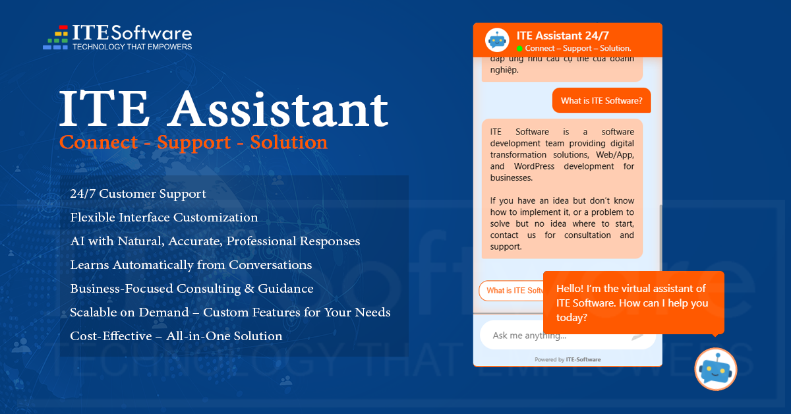

# AI Assistant and Admin Tools Documentation

Chào mừng bạn đến với tài liệu hướng dẫn sử dụng chính thức của **AI Assistant and Admin Tools**!

**AI Assistant and Admin Tools** là một plugin WordPress mạnh mẽ được thiết kế để cải thiện trang quản trị WordPress, tích hợp trợ lý ảo AI Chatbot thông minh, hỗ trợ viết bài tự động bằng AI, tùy biến trang đăng nhập thương hiệu, hiển thị banner quảng cáo đa ngôn ngữ và hệ thống ghi log bảo mật.

Tài liệu này sẽ hướng dẫn bạn từ các bước cài đặt cơ bản đến các thiết lập nâng cao để tối ưu hóa hiệu quả hoạt động của plugin trên website của bạn.

---

## 🚀 Các Bước Bắt Đầu Nhanh

1. **[Cài Đặt](installation.md)**: Hướng dẫn tải lên và kích hoạt plugin trong WordPress.
2. **[Xem Tính Năng](features.md)**: Khám phá các tính năng nổi bật mà plugin cung cấp.
3. **[Cấu Hình Hệ Thống](configuration.md)**: Chi tiết cách thiết lập API, prompt huấn luyện AI, gợi ý từ khóa và banner quảng cáo.

---

## 🔒 Bản Quyền & Phát Triển

Xem thông tin chi tiết tại trang **[Bản Quyền & Liên Hệ](license.md)**.
